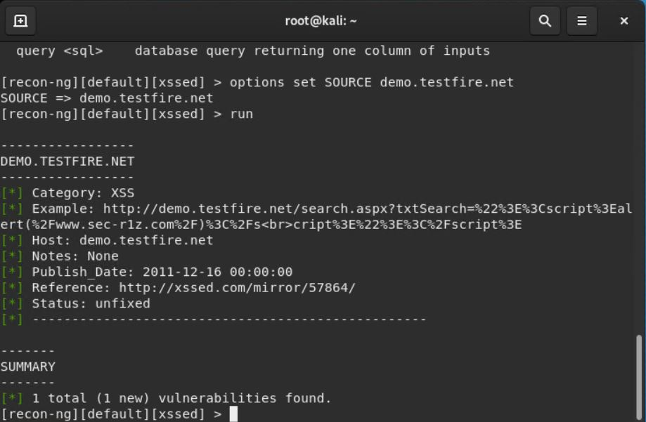

## Week 16 Homework Submission File: Penetration Testing 1

#### Step 1: Google Dorking

- Using Google, can you identify who the Chief Executive Officer of Altoro Mutual is:

Karl Fitzgerald

- How can this information be helpful to an attacker:

* An attacker can use his name to deduce possible email addresses he has and his login ID. 
   - Using the potential email addresses, the attacker can launch whale-phishing attacks.
   - Using the potential login IDs, the attacker can try to crack his password.
* The attacker can research the CEO's public interests and can use this information:
   - in phishing email attacks
   - to create dictionaries of words to brute force crack his password
* The attacker can perform social engineering attacks against other employees using tactics such as authority, intimidation and urgency.

#### Step 2: DNS and Domain Discovery

Enter the IP address for `demo.testfire.net` into Domain Dossier and answer the following questions based on the results:

  1. Where is the company located: 

* City: Sunnyvale
* State/Province: CA (California)
* Postal Code: 94085
* Country: US

  2. What is the NetRange IP address:

65.61.137.64 - 65.61.137.127

  3. What is the company they use to store their infrastructure:

Rackspace Backbone Engineering

  4. What is the IP address of the DNS server:

65.61.137.117

#### Step 3: Shodan

- What open ports and running services did Shodan find:

Shodan only found two open ports and services:
* 80: Apache Tomcat/Coyote JSP engine1.1
* 443: Apache Tomcat/Coyote JSP engine1.1
* 8080: Apache Tomcat/Coyote JSP engine1.1

[shodan results](shodan.pdf)

#### Step 4: Recon-ng

- Install the Recon module `xssed`. 
- Set the source to `demo.testfire.net`. 
- Run the module. 

Is Altoro Mutual vulnerable to XSS: 

Yes.

Reference: http://xssed.com/mirror/57864

### Step 5: Zenmap

Your client has asked that you help identify any vulnerabilities with their file-sharing server. Using the Metasploitable machine to act as your client's server, complete the following:

- Command for Zenmap to run a service scan against the Metasploitable machine: 
 
 nmap -sV 192.168.0.10
 
- Bonus command to output results into a new text file named `zenmapscan.txt`:

nmap -oN zenmapscan.txt -sV 192.168.0.10

- Zenmap vulnerability script command: 

nmap --script samba-vuln-cve-2012-1182 192.168.0.10

- Once you have identified this vulnerability, answer the following questions for your client:
  1. What is the vulnerability:
  
* https://www.cvedetails.com/cve/CVE-2012-1182/
* https://nmap.org/nsedoc/scripts/samba-vuln-cve-2012-1182.html

  2. Why is it dangerous:

Samba versions 3.6.3 and all versions previous to this are affected by a vulnerability that allows remote code execution as the "root" user from an anonymous connection.

  3. What mitigation strategies can you recommendations for the client to protect their server:

---
© 2020 Trilogy Education Services, a 2U, Inc. brand. All Rights Reserved.  
