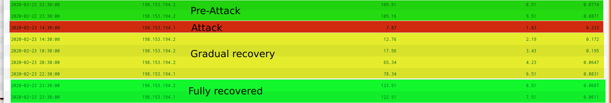
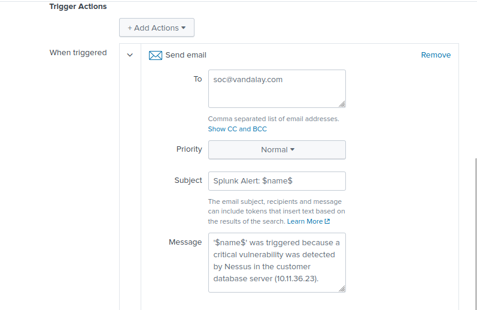
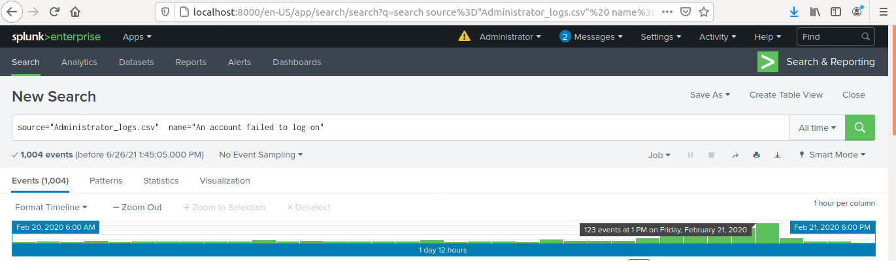

## Unit 18 Homework: Lets go Splunking!

## Vandalay Industries Monitoring Activity Instructions

### Step 1: The Need for Speed 

**Background**: As the worldwide leader of importing and exporting, Vandalay Industries has been the target of many adversaries attempting to disrupt their online business. Recently, Vandaly has been experiencing DDOS attacks against their web servers.

Not only were web servers taken offline by a DDOS attack, but upload and download speed were also significantly impacted after the outage. Your networking team provided results of a network speed run around the time of the latest DDOS attack.

**Task:** Create a report to determine the impact that the DDOS attack had on download and upload speed. Additionally, create an additional field to calculate the ratio of the upload speed to the download speed.

4. Answer the following questions:

    - Based on the report created, what is the approximate date and time of the attack?

The approximate date and time of the attack is 2020-02-23 at 14:30:00 ie 23 February 2020 around 2:30 pm.
From the logs we can see:
* the download speed drops to 7.87 megabits/s - in previous logs, the average speed was 108.1985 megabits/s.  
* the upload speed drops to 1.83 megabits/s - in previous logs, the average speed was 8.9654 megabits/s.

    - How long did it take your systems to recover?

It doesn't fully recover until 2020-02-23 23:00:00 - the complete recovery took 8.5 hours.

I also saved the search as a report:

### Step 2: Are We Vulnerable? 

**Background:**  Due to the frequency of attacks, your manager needs to be sure that sensitive customer data on their servers is not vulnerable. Since Vandalay uses Nessus vulnerability scanners, you have pulled the last 24 hours of scans to see if there are any critical vulnerabilities.

**Task:** Create a report determining how many critical vulnerabilities exist on the customer data server. Then, build an alert to notify your team if a critical vulnerability reappears on this server.

I created a search that shows the `count` of critical vulnerabilities from the customer database server `10.11.36.23`.

I created an alert to email the SOC at soc@vandalay.com if there have been any critical vulnerabilities detected in the customer database server. The alert runs daily at midnight checking the previous day's results.

The alert was saved successfully.

I also saved the search results as a report:

### Step 3: Drawing the (base)line

**Background:**  A Vandaly server is also experiencing brute force attacks into their administrator account. Management would like you to set up monitoring to notify the SOC team if a brute force attack occurs again.

**Task:** Analyze administrator logs that document a brute force attack. Then, create a baseline of the ordinary amount of administrator bad logins and determine a threshold to indicate if a brute force attack is occurring.

2. When did the brute force attack occur?

The attack started after 8 am. There were 34 events between 8 am and 9 am. 34 events is higher than the average.

The attack is at full strength during the period between 9 am and 1 pm.

The attack seems to end sometime between 1 pm and 2 pm when the events start to drop down to 34.

      
3. Determine a baseline of normal activity and a threshold that would alert if a brute force attack is occurring.

The average number of events is 12.8276.
The highest number of events in a one hour period that occurred when there wasn't an attack was 23 events. This occurred between 4 and 5 am on 21 February 2020.

Therefore, I believe that a baseline of normal activity should be less than 25 events in a one hour period.

4. Design an alert to check the threshold every hour and email the SOC team at SOC@vandalay.com if triggered. 

Submit the answers to the questions about the brute force timing, baseline and threshold. Additionally, provide a screenshot as proof that the alert has been created.
 
 
### Your Submission
  
In a word document, provide the following:
  - Answers to all questions where indicated. 
  - Screenshots where indicated.

---

© 2020 Trilogy Education Services, a 2U, Inc. brand. All Rights Reserved.
