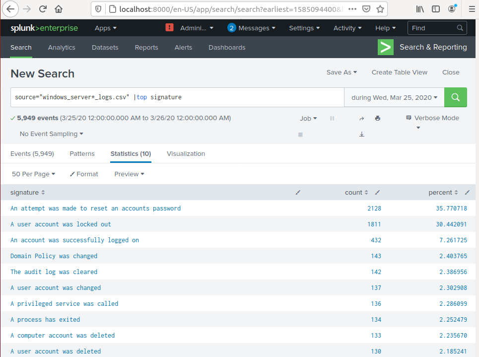
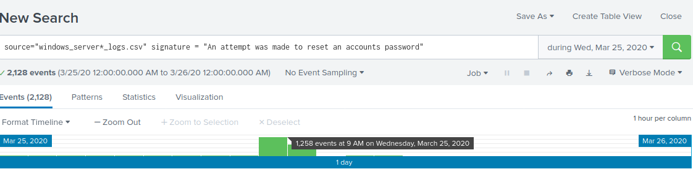
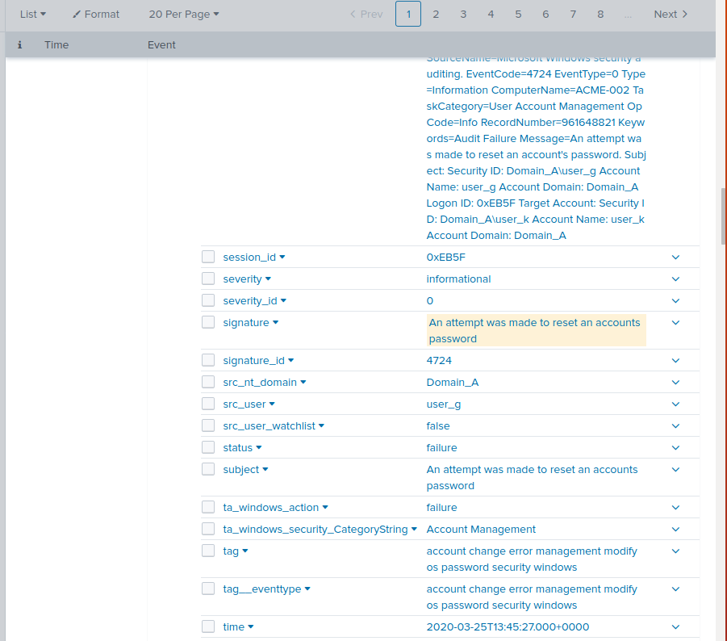

## Unit 19 Homework: Protecting VSI from Future Attacks

### Scenario

In the previous class,  you set up your SOC and monitored attacks from JobeCorp. Now, you will need to design mitigation strategies to protect VSI from future attacks. 

You are tasked with using your findings from the Master of SOC activity to answer questions about mitigation strategies.

### Logs

Use the same log files you used during the Master of SOC activity:

- [Windows Logs](resources/windows_server_logs.csv)
- [Windows Attack Logs](resources/windows_server_attack_logs.csv)
- [Apache Webserver Logs](resources/apache_logs.txt	)
- [Apache Webserver Attack Logs](resources/apache_attack_logs.txt	)

---

### Part 1: Windows Server Attack

Note: This is a public-facing windows server that VSI employees access.
 
#### Question 1

##### Analysis

I examined the signatures of the events on 25 March 2020. The attacker caused an impact to users by making a massive number of attempts to reset account passwords and caused the accounts to be locked out. 

The screenshots below show that 37.8% of the events were an attempt to reset an accounts passowrd an 30.44% of events were accounts being locked out.

The attack occurred between 9 am and 11 am. There were 2019 events during the attack (1258 in the first hour and 761 events in the second hour).

From the high number of events withi a short period, I deduce that these attacks  automated.

##### Mitigations

To prevent bots from locking out accounts, I would recommend one or more of these options:
* When a user wishes to reset a password, force them to pass a CAPTCHA test so the system to distiguish between a bot and real person making the request
* When a user's account is created, require them to enter a mobile phone number.  When a request is made to reset the password, the system should send a one-time-password to the mobile phone. If an excessive number of requests are made to reset the account password, the system should not lock out the account but should stop sending texts to the phone.
* Require the user to register with an authenticator app. When a request is made to reset the password, the user would need to use the authenticator app to confirm they are making a request to reset the password. 

#### Question 2

We need better logs and intel. What's JobeCorp's IP addresses? Our logs aren't capturing src_ip. src_nt_domain isn't useful either - according to the Splunk Knowledge Manager Manual 4.1.7 that is the Windows NT domain containing the machines that generated the event ie our local domain.

##### Mitigations
* If we can find out the IP addresses of the machines that JobeCorp intend to use, we could set the firewall to block them. 
* If JobeCorp intend to create a DDOS using a botnet of zombies, we should implement one or more of the suggestions in Part 1 Question 1: introducing CAPTCHA, sending one-time-passcodes to a verified owner's mobile phone or require an authenticator app.

### Part 2: Apache Webserver Attack:

#### Question 1
- Based on the geographic map, recommend a firewall rule that the networking team should implement.
- Provide a "plain english" description of the rule.
  - For example: "Block all incoming HTTP traffic where the source IP comes from the city of Los Angeles."
- Provide a screen shot of the geographic map that justifies why you created this rule. 
  
#### Question 2

- VSI has insider information that JobeCorp will launch the same webserver attack but use a different IP each time in order to avoid being stopped by the rule you just created.

- What other rules can you create to protect VSI from attacks against your webserver?
  - Conceive of two more rules in "plain english". 
  - Hint: Look for other fields that indicate the attacker.
  

### Guidelines for your Submission:
  
In a word document, provide the following:
- Answers for all questions.
- Screenshots where indicated

Submit your findings in BootCampSpot!

---

© 2020 Trilogy Education Services, a 2U, Inc. brand. All Rights Reserved.
