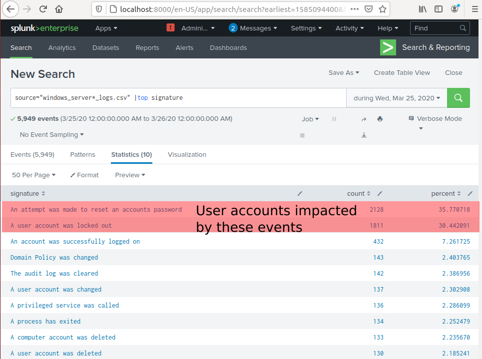

## Unit 19 Homework: Protecting VSI from Future Attacks

### Scenario

In the previous class,  you set up your SOC and monitored attacks from JobeCorp. Now, you will need to design mitigation strategies to protect VSI from future attacks. 

You are tasked with using your findings from the Master of SOC activity to answer questions about mitigation strategies.

### Logs

Use the same log files you used during the Master of SOC activity:

- [Windows Logs](resources/windows_server_logs.csv)
- [Windows Attack Logs](resources/windows_server_attack_logs.csv)
- [Apache Webserver Logs](resources/apache_logs.txt	)
- [Apache Webserver Attack Logs](resources/apache_attack_logs.txt	)

---

### Part 1: Windows Server Attack

Note: This is a public-facing windows server that VSI employees access.
 
#### Question 1

##### Analysis

I examined the signatures of the events on 25 March 2020. The attacker caused an impact to users by making a massive number of attempts to reset account passwords and caused the accounts to be locked out. 

The screenshots below show that 37.8% of the events were an attempt to reset an accounts passowrd an 30.44% of events were accounts being locked out.

The attack occurred between 9 am and 11 am. There were 2019 events during the attack (1258 in the first hour and 761 events in the second hour).

From the high number of events withi a short period, I deduce that these attacks were automated.

##### Mitigations

To prevent bots from locking out accounts, I would recommend one or more of these options:
* When a user wishes to reset a password, force them to pass a CAPTCHA test so the system to distiguish between a bot and real person making the request
* When a user's account is created, require them to enter a mobile phone number.  When a request is made to reset the password, the system should send a one-time-password to the mobile phone. If an excessive number of requests are made to reset the account password, the system should not lock out the account but should stop sending texts to the phone.
* Require the user to register with an authenticator app. When a request is made to reset the password, the user would need to use the authenticator app to confirm they are making a request to reset the password. 

#### Question 2

##### Analysis

We need better logs and intel. What's JobeCorp's IP addresses? Our logs aren't capturing src_ip. src_nt_domain isn't useful either - according to the Splunk Knowledge Manager Manual 4.1.7 that is the Windows NT domain containing the machines that generated the event ie our local domain.

##### Mitigations
* If we can find out the IP addresses of the machines that JobeCorp intend to use, we could set the firewall to block them. 
* If JobeCorp intend to create a DDOS using a botnet of zombies, we should implement one or more of the suggestions in Part 1 Question 1: introducing CAPTCHA, sending one-time-passcodes to a verified owner's mobile phone or require an authenticator app.

### Part 2: Apache Webserver Attack:

#### Question 1

##### Analysis

There was a noticeably higher number of hits to the VSI Account logon page (/VSI_Account_login.php) from Ukraine. 

Hits from Ukraine are 91.011% of the total hits to the login page:

The hits from the Ukraine are spread across multiple cities:

It should be mentioned that this was a DDOS. It was not an attempt to brute force crack any passwords - we can see from the logs that there was only one 403 error.

##### Mitigations

To mitigate this threat, block all incoming HTTP traffic where the source IP comes from the country of Ukraine.

#### Question 2

##### Analysis

I examined the 1296 events where the source IP address was in Ukraine to try to determine if any patterns were common to the events:

In particular, I examined interesting fields:

**All of the events had the same useragent value:** Mozilla/4.0 (compatible; MSIE 6.0; Windows NT 5.2; SV1; .NET CLR 2.0.50727987787; InfoPath.1)

I was curious how common that specific useragent was. 
In all our Apache logs:
* it was the 2nd most common useragent
* all of the 1296 events with that useragent were part of the Ukrainian attack.\

**Although the attacks came from three different IP addresses in three different cities, they were extremely well coordinated to attack at the same time (req_time.**

There were other extremely common fields that were obviously not interesting:
* *file*, *uri* and *uri_path* were all the same because the bots were requesting the same URL.
* *punct* is a field of the first 30 punctuation characters in the first line of the event. They are all the same because all the events use the same Apache log format.
* all the *method* values were HTTP POST.
* all the *status*, *version*, *status*, *linecount*, *bytes*, and *referer* values were the same in all the vents because the HTTP requests were identical.

##### Mitigations

The goal of DDOS is to overwhelm the web server. The attacks haven't tried to brute force crack any passwords. So the mitigation strategies in Part 1 Question 1 won't be effective.

Here are rules to mitigate the attack against the web server:
* Block any IP addresses that have the useragent value of "Mozilla/4.0 (compatible; MSIE 6.0; Windows NT 5.2; SV1; .NET CLR 2.0.50727987787; InfoPath.1)"
* Create a white list of IP addresses that can access the VSI Account logon page (/VSI_Account_login.php). All other IP addresses are blocked from using that page.

